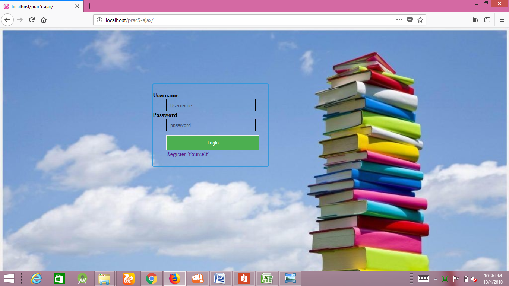
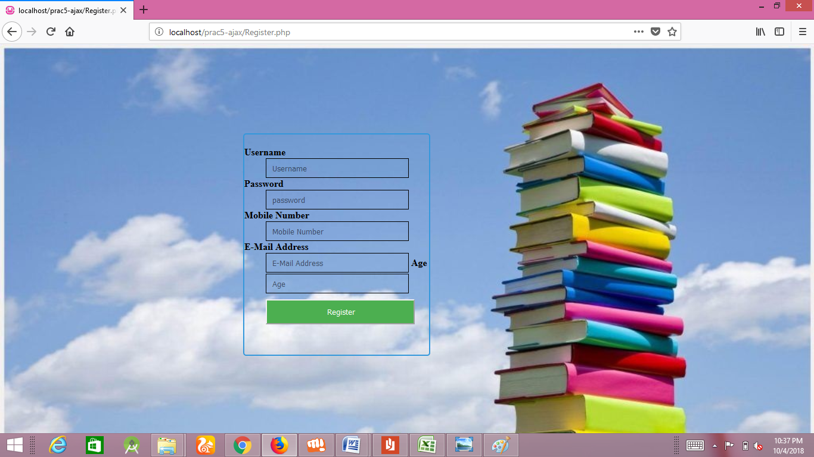

# Selenium-QTP
Created a small web-based application by selecting relevant system environment/platform and programming languages. Narrate concise Test Plan consisting features to be tested and bug taxonomy. Narrate scripts in order to perform regression tests. Identify the bugs using Selenium Web Driver and IDE and generate test reports encompassing exploratory testing.  

<h3><b>Step by Step Tutorial  </b></h3>

1. First of Download Latest Eclipse java photon-R version.  
2. Download latest selenium-server-standalone-3.13.0 jar File from following link https://www.seleniumhq.org/download/ here on site 3.14.0 version is latest                                  
3. Download and Extract geckodriver.exe for windows on any drive of computer. https://github.com/mozilla/geckodriver/releases here 2.42 is latest version 
4. After Download Extract same on any Drive here I extract on C Drive and my path of that exe file is C:\geckodriver_win64 it will look as follows:    
5. Now Open Eclipse IDE-----> Create Java Project- →
 Right Click Project Name →
Properties
→
 Java 
Build Path
→
Libraries
→
Add External JAR →
 Add selenium-java-3.14.1 jar 
→
Apply and Close. 
6. Now Want Open the Firefox browser with index2.html page via Selenium Web driver Java Coding so here we need to write Java Code in Class file which we already created 

7. I Created Demo1 Java Project Folder name and Test.java is my class file so write java code in this class file:   

9. Right click on java program, select Run As and > “Java Application”. Now the Firefox browser will open and the first page i.e. the Home page will open:   

10.  The next page that will open as follows:

11. The next command is to open a link as follows:     

